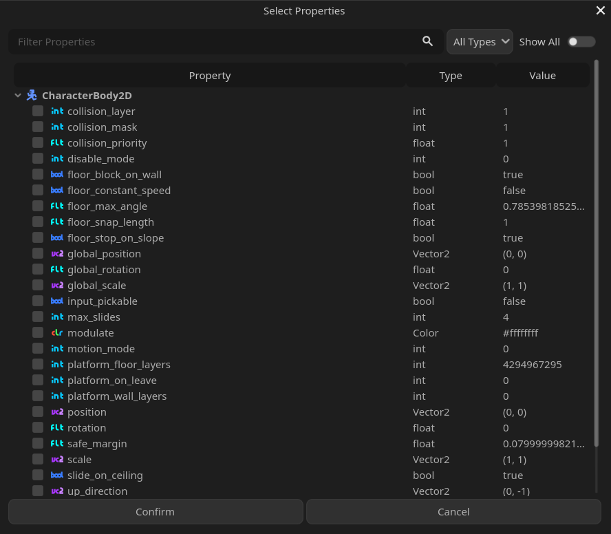
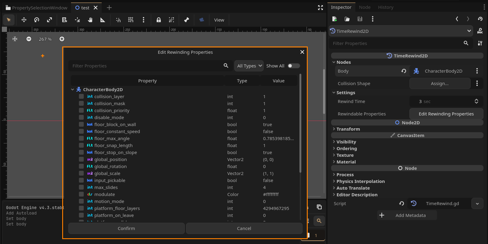

# Property Selection Window

<div align="center>


[](LICENSE)
[](https://godotengine.org/)

A powerful Godot plugin that streamlines property management with an intuitive interface. Designed for seamless integration with the Godot editor, it enhances your development workflow through advanced filtering, type-based organization, and efficient property handling.

</div>



## Features

### Property Tree
- Hierarchical property visualization
- Intelligent organization and nesting
- Real-time value previews
- Responsive layout with proper scaling

### Advanced Filtering
- Performance-optimized search with debouncing
- Type-based filtering system
  - Custom Classes are recognized
- Toggleable engine property visibility

### Property Management
- Automatic type detection and formatting
- Circular reference protection
- Real-time value monitoring
- Multi-select with checkbox support
- Persistent selection states
- Bulk selection operations

## Installation

**Via Asset Library**
1. Open the Godot Asset Library within your project
2. Search for "Property Selection Window"
3. Download and install the plugin

**Via Git**
```bash
git clone https://github.com/username/property-selection-window.git
cp -r property-selection-window/addons/property_selection_window path/to/your/project/addons/
```

**Enable the Plugin**
1. Navigate to `Project → Project Settings → Plugins`
2. Locate `Property Selection Window`
3. Enable the plugin via the checkbox

## Implementation

### Basic Usage

```gdscript
var property_selector = PropertySelectionWindow.new()
property_selector.create_window(
    target_node,            # Node to inspect
    initially_selected,     # [Optional] Pre-selected properties
    show_hidden_properties, # [Optional] Show engine properties
    type_filter,           # [Optional] Initial type filter
    callback               # [Optional] Selection callback
)

# Handle selections
func _on_properties_selected(selected_properties: Array[String]):
    print("Selected:", selected_properties)
```

### Advanced Features

```gdscript
# Filtering
property_selector.set_type_filter(TYPE_FLOAT)    # Filter by type
property_selector.set_filter("position")         # Search filter
property_selector.toggle_hidden_properties(true) # Show all properties

# Tree Management
property_selector.expand_all()      # Expand all nodes
property_selector.collapse_all()    # Collapse all nodes
property_selector.refresh_tree()    # Refresh property tree

# Property Operations
if property_selector.property_exists("position"):
    var type = property_selector.get_property_type("position")
    var value = property_selector.get_property_value("position")
    property_selector.set_property_value("position", Vector2(100, 100))
```

## API Reference

### Signals

| Signal | Description |
|--------|-------------|
| `properties_selected(selected_properties: Array[String])` | Emitted when properties are confirmed |

### Core Methods

| Method | Description |
|--------|-------------|
| `create_window(...)` | Creates and displays the property selection window |
| `set_target(new_target: Node)` | Updates the target node |
| `set_filter(filter_text: String)` | Applies a search filter |
| `set_type_filter(filter: int)` | Sets type-based filtering |
| `toggle_hidden_properties(show: bool)` | Controls visibility of engine properties |

### Utility Methods

| Method | Description |
|--------|-------------|
| `expand_all()` | Expands all tree items |
| `collapse_all()` | Collapses all tree items |
| `refresh_tree()` | Refreshes the property tree |
| `get_all_properties()` | Returns available properties |
| `property_exists(property_name: String)` | Checks property existence |
| `get_property_type(property_name: String)` | Returns property type |
| `get_property_value(property_name: String)` | Retrieves property value |
| `set_property_value(property_name: String, value: Variant)` | Sets property value |

## Integration Example

Example integration with [TimeRewind2D](https://github.com/imtani/godot-time-rewind-2d/) plugin:



```gdscript
func _open_property_selector_window(time_rewind: Node2D) -> void:
    if not is_instance_valid(time_rewind):
        push_error("TimeRewind2D: Invalid time_rewind instance")
        return
    
    if not is_instance_valid(time_rewind.body):
        push_error("TimeRewind2D: Invalid body reference")
        return

    var property_selector = PropertySelectionWindow.new()
    var rewindable_properties = time_rewind.get("rewindable_properties") or []

    property_selector.create_window(
        time_rewind.body,
        rewindable_properties,
        false,
        -1,
        func(selected_properties: Array[String]):
            time_rewind.set("rewindable_properties", selected_properties)
    )
```

## Contributing

1. Fork the repository
2. Create a feature branch (`git checkout -b feature/NewFeature`)
3. Commit your changes (`git commit -m 'Add NewFeature'`)
4. Push to the branch (`git push origin feature/NewFeature`)
5. Open a Pull Request

## License

Distributed under the MIT License. See [`LICENSE`](LICENSE) for more information.

---

<div align="center">
Built for the Godot community
</div>